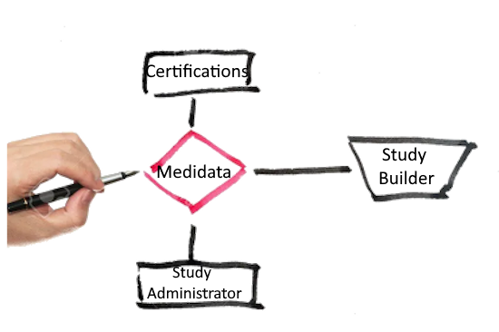

----------------------------------------------------
# CustomFunctions

-  `Custom Functions written in Visual Basic`
-  `Custom Functions written in C# sharp`

/* This is public domain code. No guarantee as to suitability or accuracy is
 given or implied. User uses this code entirely at their own risk.*/
